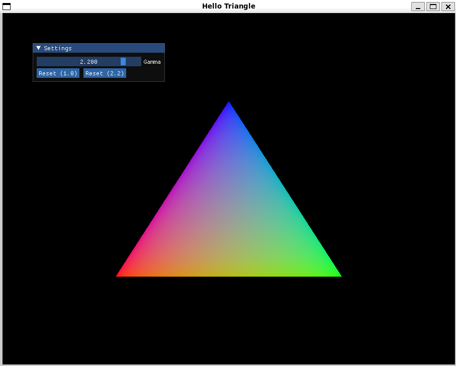
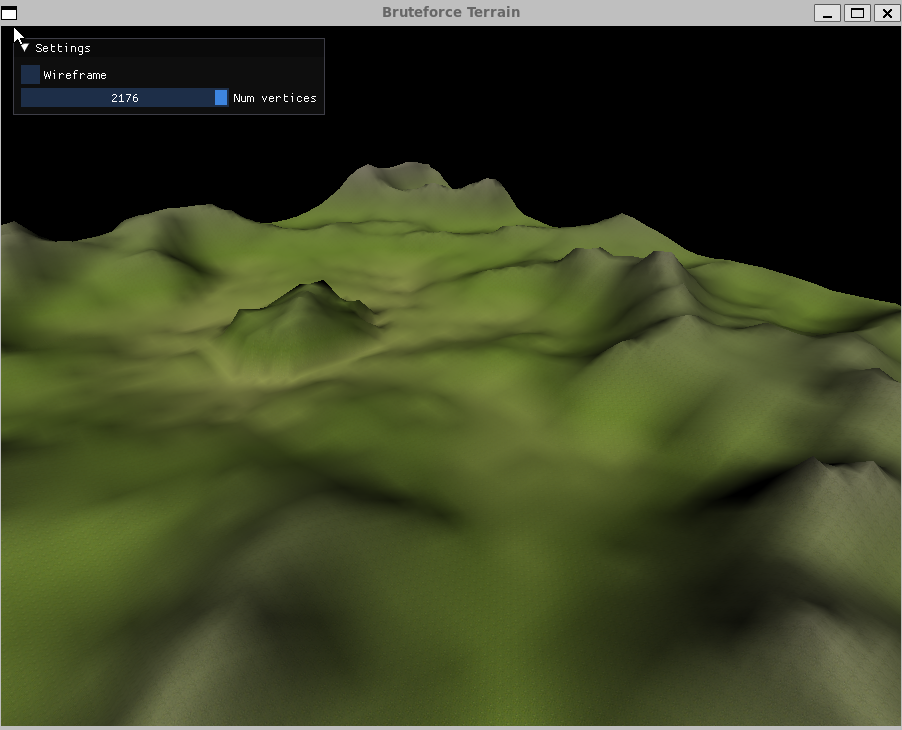

:icons: font
:toc:

= OpenGL Rust
:hello-triangle: https://learnopengl.com/Getting-started/Hello-Triangle
:voxel-rendering-repo: https://github.com/platc2/VoxelRendeirng
:opengl-from-scratch: http://nercury.github.io/rust/opengl/tutorial/2018/02/08/opengl-in-rust-from-scratch-00-setup.html
:rustup: https://rustup.rs/

toc::[]

Example project for small OpenGL programs written in Rust. The project consists of a library for asset-management and opengl-wrappers as well as multiple binaries.

[cols="~,~",stripes=odd]
|===
|Hello Triangle
|{hello-triangle}[Hello Triangle^] OpenGL example with https://learnopengl.com/Advanced-Lighting/Gamma-Correction[gamma correction^]

|Sobel Cube
|Rotating cube to which multiple filter kernels are applied

|Bruteforce Terrain
|Bruteforce algorithm to render noise terrain
|===

Code has been ported from C++ to Rust from {voxel-rendering-repo}[this repository^] and extended using {opengl-from-scratch}[this article^].

== Installation

I recommend using {rustup}[rustup^] to setup the development environment for Rust. Follow the {rustup}[tutorial^] to setup your development environment including cargo, the package/build manager for Rust.

== Usage

NOTE: Documentation for the library will be added at a later stage, when the API is more stable

Once {rustup}[rustup^] has been installed, you can build the project using `cargo build` or `cargo build --release` for a release-build respectively.

NOTE: You might be required to install development libraries for any of the dependencies (SDL2, OpenGL)

You can execute the binaries directly from cargo using `cargo run --bin <binary-name>`.
If no binary name is supplied, the command fails and the list of possible binaries is printed to console.

== Images

.Hello Triangle

.Sobel Cube
image::images/sobel_cube.png[width=25%]

.Bruteforce Terrain

